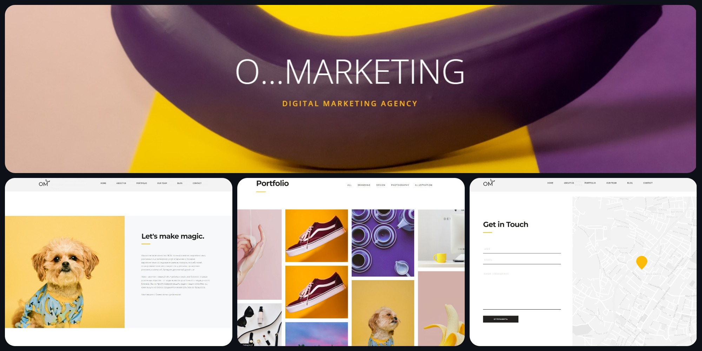
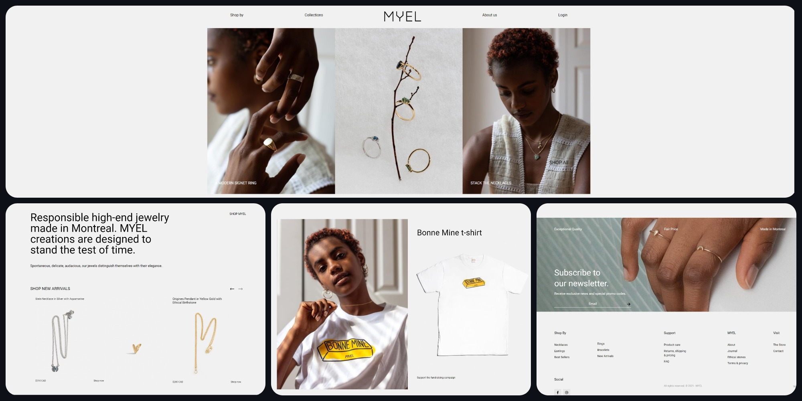

# Тренировочные проекты

Репозиторий создан для хранения свёрстанных тренировочных макетов в период обучения.

- Проекты располагаются по порядку времени их завершения
- К каждому проекту есть короткое описание
- К каждому проекту добавлены мои коментарии
- Посмотреть сам проект можно нажав на ссылку выделенную по примеру первого проекта :point_right: [Wordpress](https://Twincki.github.io/wordpress/src/) :point_left:
- По окончанию каждого проекта, доработок или исправлений не будет, с целью
  понимания уровня развития на каждом этапе

---

## :ru: [Wordpress](https://Twincki.github.io/wordpress/src/)

Проект был создан по одному из курсов верстки **'Udemy'** :clap:

Если вас интересует макет :point_right: [здесь](https://www.figma.com/file/dmDxKhqtcdB2tQagsgFz8U/WordPress2)

О проекте:

- Лендинг
- Использовался html и css

> Самый первый и самый простой сверстанный мной сайт, на нем я научился базовым вещам.

---

## :us: [SakaAgency](https://Twincki.github.io/SakaAgency/src/)

Проект был выполнен для закрепления знаний. Выполнен с бесплатного макета **Figma**.

Если вас интересует макет :point_right: [здесь](https://www.figma.com/file/QIETjlMfRC7ZfZ1jCG6nGe/Digital-Agency?node-id=0%3A1)

О проекте:

- Лендинг
- Использовался html и css

> Проект был сложным так как верстал все сам с макета. После первого проекта закрепил знания.

---

## :ru: [Uber](https://Twincki.github.io/Uber/src/)

О проекте:

- Лендинг
- Использовался html, sass, JavaScript
- Адаптирование под все устройства

На данном проекте я получил новые знания, в частности научился анимировать, использовать позиционирование, применять модуль sass. Адаптировать проект под разные устройства.

Если вас интересует макет :point_right: [здесь](<https://www.figma.com/file/idD8FvhA1hC8hc98hE0YSl/UBER_course-(Copy)?node-id=0%3A1>)

> Верстка для меня была простой на этом проекте, так же анимация мне далась легко. Адаптация под разные устройства не показалась сложной, но доставило не мало трудностей.

## :us: [OMarketing](https://Twincki.github.io/OMarketing/src/)

О проекте:

- Лендинг
- Использовался html, sass, JavaScript + библиотеки для слайдеров

Проект выполнялся по курсу SW.Band [Вадим Прокопчук]. Научился многому, а в частности создавать слайдеры, фото коллажи разных форм, использовал новые анимации и быстрые переходы по странице.

Если вас интересует макет :point_right: [здесь](https://www.figma.com/file/Ha9Mr6NqIGrCOolgpDImeg/%5BSW.BAND%5D-O-marketing?node-id=0%3A1&t=NFWryPdUjvb1hqNu-0)

> Один из самых интересных макетов которые я верстал, многому научился и закрепил знания.

---

## :us: [MySite](https://Twincki.github.io/MySite/src/)

## :us: [Myel](https://Twincki.github.io/Myel/src/)

